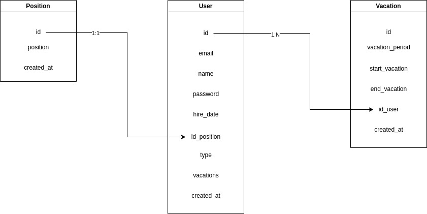

# Backend desafio Working Minds

# Índice

-   [Visão Geral](#visão-geral)
-   [Tecnologias](#tecnologias)
-   [Documentação](#documentação)
-   [Rotas](#rotas)
-   [Banco de dados](#banco-de-dados)
-   [Instalação e Uso](https://chat.openai.com/#instala%C3%A7%C3%A3o-e-uso)

# Visão Geral

Este repositório contém a parte de backend do desafio para o desafio para a empresa working minds

# Tecnologias

- [Typescript](https://www.typescriptlang.org/)
- [Nest](https://nestjs.com/)
- [Prisma](https://www.prisma.io/)
- [Mysql](https://www.mysql.com/)
- [Dotenv](https://www.npmjs.com/package/dotenv)
- [Json Web Token](https://jwt.io/)
- [Bcrypt](https://www.npmjs.com/package/bcrypt)
- [Eslint](https://eslint.org/)
- [Jest](https://jestjs.io/pt-BR/)
- [Convetional Commits](https://www.conventionalcommits.org/pt-br/v1.0.0/)
- [Open Api](https://www.openapis.org/)

# Documentação

Acesse a rota `/api/v1.0` para intergagir com a parte backend da aplicação em tempo real

# Rotas

A parte backend possui as rotas:

**Fluxo de Cargos**
Essa rota é responsável por gerenciar os cargos existentes na empresa, mas será necessário privilégios admnistrativos

POST `/position`

GET `/position`

GET `/position/:id`

PATCH `/position/:id`

DELETE `/position`

**Fluxo de Usuário**
Essa rota é responsável por gerenciar usuários dentro do sistema

POST `/user`

GET `/user`

GET `/user/:id`

PATCH `/user/:id`

DELETE `/user`

**Fluxo de Login**
Essa rota é responsável por realizar login no sistema

POST `/login`

**Fluxo de Férias**
Essa rota é responsável por gerenciar férias dentro do sistema

POST `/vacations`

GET `/vacations`

GET `/vacations/:id`

PATCH `/vacations/:id`

DELETE `/vacations`

# Banco de dados

Estruturei o banco de dados da seguinte forma:

# Instalação e uso